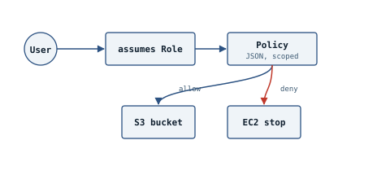

# Lab 1 — IAM

**Domain:** Security · **Scenario:** A new developer needs read-only S3 access and the ability to start/stop *only* dev-tagged EC2 instances. An EC2 app needs to read one S3 bucket with no stored credentials.

A user assumes a scoped role instead of holding long-term keys; the attached policy allows one action and denies another, tag by tag.

## Build it three ways

- [`cloudformation.yaml`](cloudformation.yaml) — `aws cloudformation deploy --template-file cloudformation.yaml --stack-name aws-lab-01-iam --capabilities CAPABILITY_NAMED_IAM --parameter-overrides BucketName=my-invoices-2026`
- [`cli-commands.sh`](cli-commands.sh) — the same result, one `aws iam` call at a time
- Console: IAM → User groups → Create group → attach `AmazonS3ReadOnlyAccess` → add a custom tag-conditioned policy → create a role for EC2

## Checkpoint questions

- User vs. Group vs. Role vs. Policy — what's the difference?
- Why does an explicit Deny always beat an Allow?
- Why use an IAM role on EC2 instead of access keys in application code?

## Interview question

*"A contractor needs temporary access to one S3 bucket for two weeks. How would you set that up?"*
